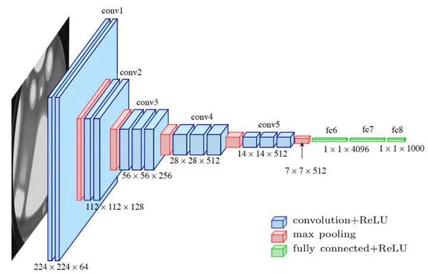

# This repository is used for ML learning path. It contains the following branches:

| Branch| Description|
| --- | --- |
| [main](https://github.com/Fashionism-Bangkit-Capstone/Fashionism-Machine-Learning.git)  | This branch contains the main documentation for the ML learning path. |
| [model-deployment](https://github.com/Fashionism-Bangkit-Capstone/Fashionism-Machine-Learning/tree/model-deployment) | This branch contains the model deployment process. |

**This Machine Learning Project is possible by this people and organization.**
| Description| Explanation|
| --- | --- |
| IQON3000 Dataset. [Download](https://drive.google.com/file/d/1sTfUoNPid9zG_MgV--lWZTBP1XZpmcK8/view)| (From the dataset owner) We created a new large dataset for personalized clothing matching. In particular, we crawled our data from the popular fashion web service Iqon (www.iqon.jp), where users are encouraged to create outfits by coordinating fashion items from complementary categories (e.g., tops, bottoms, shoes and accessaries). The created IQON3000 contains 308,347 outfits created by 3,568 users with 672,335 fashion items.|
| [Web Scraper - Free Web Scraping](https://chrome.google.com/webstore/detail/web-scraper-free-web-scra/jnhgnonknehpejjnehehllkliplmbmhn)| This free extension is used to gather link to improve the datasets.|
| ResNet50 by Microsoft| Base model for feature extraction|
| VGG-16 CNN Architecture| They tested the architecture so we can copy their CNN structure|
| BANGKIT 2023| Thankyou for a lot of skills we gained through this program, we can't give enough thanks for this program|
| The frameworks creator| As someone without an IT background who started learned programming on my own, I truly appreciate and want to express my gratitude to all the companies and individuals who have developed frameworks that enable newcomers like me to create machine learning models without delving too deeply into the complex mathematical implementations in the code.|

# Machine Learning Processes Diagram
[ML Process Diagram](Images/ML.png)

# **Table of contents**

- [TOP_BOTTOM_MODELLING Documentation](#top_bottom_modelling-documentation)
  - [Code Overview](#code-overview)
  - [Usage and Results](#usage-and-results)
- [Initial Recommendation Documentation (Initial_recommendation_algorithm.ipynb)](#initial-recommendation-documentation-initial_recommendation_algorithmipynb)
  - [Importing the library](#importing-the-library)
  - [Download and Preparing the dataset](#download-and-preparing-the-dataset)
  - [Initial modelling to test the recommendtion algorithm](#initial-modelling-to-test-the-recommendtion-algorithm)
  - [Feature Extraction Testing](#feature-extraction-testing)
  - [Testing the recommendation model](#testing-the-recommendation-model)
- [Flask Deployment Documentation (App.py)](#flask-deployment-documentation-apppy)
  - [Importing Libraries and Modules](#importing-libraries-and-modules)
  - [Functions](#functions)
  - [Model and Data Loading](#model-and-data-loading)
  - [Flask App and API](#flask-app-and-api)
- [Bibliography](#bibliography)

# TOP_BOTTOM_MODELLING Documentation
.png)
This code performs the task of constructing a dataset, downloading images, and training a model for classifying top and bottom clothing items. The documentation provides an overview of the code structure and its functionality. Full python notebook can be seen [here](https://github.com/Fashionism-Bangkit-Capstone/Fashionism-Machine-Learning/blob/main/TOP_BOTTOM_MODELLING.ipynb)

## Code Overview
The code is written in Python and runs in a Jupyter Notebook environment. It consists of several sections, each performing a specific task. Here is an overview of each section:

### Importing Dependencies
The code begins by importing the necessary dependencies, including libraries such as pandas, requests, zipfile, and concurrent.futures. It also imports specific modules from these libraries and sets up additional configurations.

### CSV Extracting
In this section, the code uploads and extracts CSV files containing image and style data. It uses the `files.upload()` function to upload the files and the `!unzip` command to extract them. After extraction, the original zip files are removed.

### Dataset Loading and Processing
This section focuses on loading and processing the dataset for training the model. It reads the CSV files into Pandas DataFrames and merges them based on the "filename" column. It filters the data to include only "Apparel" items and changes the "subCategory" values to "Top" and "Bottom" accordingly. The code then balances the dataset by sampling an equal number of rows for each category. Finally, it shuffles the rows of the balanced DataFrame.

### Image Downloading
In this section, the code downloads the images corresponding to the URLs in the dataset. It defines a function to download an image given a URL and local directory. It creates a directory called "dataset" and uses multithreading to download images concurrently. The progress of the download tasks is tracked, and the completed count is displayed.

### Modeling
  
This section focuses on training the classification model for top and bottom clothing items. It splits the dataset into training and testing sets. It also creates an ImageDataGenerator for data augmentation and preprocessing. The VGG16 pre-trained model is loaded and frozen as the base model. The code then constructs the model architecture by adding additional layers on top of the base model. The model is compiled with appropriate optimizer and loss functions. Early stopping is implemented to prevent overfitting during training. The model is trained on the training set and evaluated on the test set. Finally, the trained model is saved as "top_down_new_model.h5".

## Usage and Results
To use the code, it needs to be executed in a Jupyter Notebook environment. The code performs the following tasks:
1. Extracts CSV files containing image and style data.
2. Balances and preprocesses the dataset.
3. Downloads the corresponding images from URLs.
4. Trains a model using the VGG16 architecture to classify top and bottom clothing items.
5. Evaluates the model's performance on the test set.
6. Saves the trained model for future use.

Throughout the code execution, progress updates and relevant information are displayed.

The final trained model ("top_down_new_model.h5") can be used for predicting the category (top or bottom) of new clothing images.

Note: It's important to review and understand the code before running it to ensure it fits your specific requirements and dataset structure.

This concludes the documentation for the provided code.

# Initial Recommendation Documentation (Initial_recommendation_algorithm.ipynb)

This recommendation is the main foundation of the full deployment docummentation, here we test the algorithm on Google Colab Environment. The full ipynb files can be seen here [TEST THIS](https://github.com/Fashionism-Bangkit-Capstone/Fashionism-Machine-Learning/blob/main/Initial_Recommendation_Algorithm.ipynb).

## Importing the library
The code includes multiple import statements that import various libraries and modules. Here is a summarized documentation of the libraries and modules imported:

- `gdown`: A library used for downloading datasets from Google Drive.
- `os`: A library used for managing file paths, creating directories, and performing file operations.
- `json`: A library used for working with JSON files, allowing for reading and writing JSON data.
- `pickle`: A library used for serializing and deserializing Python objects, enabling object storage and retrieval.
- `re`: A library used for working with regular expressions, allowing for pattern matching and manipulation of strings.
- `cv2`: A library used for image processing and computer vision tasks, providing functions for image manipulation, feature extraction, and object detection.
- `concurrent.futures`: A library used for parallel computing, providing a high-level interface for asynchronously executing code and performing tasks concurrently.
- `random`: A library used for generating random numbers, commonly used for tasks involving randomness or random sampling.
- `shutil`: A library used for file and directory operations, providing functions for copying, moving, renaming, and deleting files or directories.
- `pandas`: A library used for data manipulation and analysis, providing data structures and functions for handling structured data, such as data frames.
- `numpy`: A library used for numerical operations in Python, providing functions and data structures for handling multi-dimensional arrays and mathematical operations.
- `matplotlib.pyplot`: A library used for creating visualizations, such as plots, graphs, and histograms.
- `PIL.Image`: A library used for image processing tasks, including opening, manipulating, and saving images in various formats.
- `google.colab.files`: A library used for file upload and download in Google Colab, enabling interaction with files in the Colab environment.
- `numpy.linalg.norm`: A function that computes the norm of a vector or matrix, commonly used for vector normalization.
- `tqdm`: A library used for creating progress bars to track the progress of loops or tasks that take a long time to complete.
- `tensorflow`: A library used for deep learning models and operations, providing tools and functions for building, training, and evaluating neural networks.
- `keras.preprocessing.image.ImageDataGenerator`: A module in Keras used for image data preprocessing, including data augmentation, normalization, and resizing.
- `sklearn.model_selection.train_test_split`: A library used for splitting data into training and testing sets, commonly used for evaluating machine learning models.
- `sklearn.utils.shuffle`: A library used for shuffling data, randomizing the order of data samples.
- `keras.callbacks.EarlyStopping`: A callback in Keras used for early stopping during model training, helping to prevent overfitting and save computational resources.
- `keras.models.load_model`: A function in Keras used for loading pre-trained models.
- `keras.layers.GlobalMaxPooling2D`: A layer in Keras used for global max pooling, often used in convolutional neural network architectures.
- `keras.applications.ResNet50`: A pre-trained convolutional neural network model in Keras known as ResNet-50.
- `keras.applications.resnet.preprocess_input`: A function used for preprocessing input images specifically for ResNet models.
- `sklearn.neighbors.NearestNeighbors`: A library used for performing nearest neighbor search, a common algorithm for finding similar items or observations.
- `matplotlib.image`: A library used for loading and displaying images in matplotlib.

These libraries and modules provide a wide range of functionality for tasks such as downloading datasets, managing files, working with JSON data, image processing, parallel computing, data manipulation and analysis, numerical operations, visualization, deep learning, model training, and more.

## Download and Preparing the dataset
The code provided performs various steps to download, prepare, and manipulate a dataset. Here is a summarized documentation of the code:

1. **Data Download**: The code starts by downloading a dataset from a specified URL using the `gdown.download` function. The downloaded file is saved to a specified output path.

2. **Unzipping**: The downloaded dataset is then unzipped using the `unzip` command to extract the contents of the ZIP file.

3. **Converting JSON to CSV**: The code defines a function `process_json_file` that processes JSON files and extracts relevant information. Another function `convert_json_to_csv` is defined to convert all JSON files in a specified base directory to a single CSV file. The JSON files are processed concurrently using `concurrent.futures.ThreadPoolExecutor` for improved performance. The resulting data is stored in a pandas DataFrame (`df`).

4. **Preparing the Dataset**: The code performs several operations to prepare the dataset in the DataFrame (`df`):
   - New columns "category" and "color" are created by splitting the existing "category_x_color" column.
   - The "category" values are mapped to "Top", "Bottom", or "Accessories" based on predefined lists of categories.
   - Unnecessary columns ("category_x_color", "category", "color") are dropped.
   - Rows with the category "Accessories" are dropped from the DataFrame.
   - Rows with "setId" values that occur only once are dropped from the DataFrame.
   - The current progress of the DataFrame is saved to a CSV file ("dataset2.csv").

5. **Sampling the Dataset**: A fraction of the DataFrame is sampled for training purposes. Rows are randomly selected based on a specified fraction (`frac`) and a random seed (`random_state`).
   - Rows with "setId" values that occur only once are dropped from the DataFrame.
   - The current progress of the DataFrame is saved to a CSV file ("dataset3.csv").

6. **Checking Image Validity**: The code defines a function `is_image_valid` that checks whether an image file is valid by attempting to open it using the `Image.open` function from the PIL library. The code then iterates over each row in the DataFrame, checks if the image file exists and is valid, and creates a new DataFrame (`df`) containing only the valid rows.
   - The current progress of the DataFrame is saved to a CSV file ("dataset4.csv").

7. **DataFrame Shape**: The shape (number of rows and columns) of the DataFrame is printed.

This code performs tasks such as downloading and unzipping a dataset, processing JSON files, converting them to a CSV format, preparing the dataset by manipulating and filtering the DataFrame, sampling a fraction of the dataset, checking image validity, and saving the progress at various stages.

## Initial modelling to test the recommendtion algorithm
The provided code performs initial top-down modeling to test the algorithm. Here is a summarized documentation of the code:

1. **Splitting the DataFrame**: The code splits the DataFrame (`df`) into training and testing data using the `train_test_split` function from scikit-learn. The testing data size is set to 20% of the total dataset, and a random seed is specified for reproducibility. The resulting training and testing DataFrames are named `train_df` and `test_df`, respectively.

2. **Image Preprocessing and Data Augmentation**: The code defines image preprocessing parameters, such as the target image size and batch size. It then creates an instance of `ImageDataGenerator` from Keras and applies pixel normalization (rescaling) to the training data. Two `flow_from_dataframe` generators are created for the training and validation datasets, respectively, using the training DataFrame (`train_df`). These generators preprocess the images and augment the training data.

3. **Building the CNN Model**: The code builds a sequential CNN model using the Keras framework. The model consists of several convolutional layers, max pooling layers, a flattening layer, and fully connected layers. The final layer uses the sigmoid activation function for binary classification.

4. **Compiling the Model**: The model is compiled using the Adam optimizer, binary cross-entropy loss function, and accuracy metric.

5. **Early Stopping Callback**: An early stopping callback is defined to monitor the validation accuracy and stop training if it does not improve for a certain number of epochs.

6. **Training the Model**: The model is trained using the `fit` function. The training generator (`train_generator`) is used for training, and the validation generator (`validation_generator`) is used for evaluation. The specified number of epochs is set to 100, and the early stopping callback is applied.

7. **Evaluating the Model**: A test data generator (`test_generator`) is created for the testing DataFrame (`test_df`). The model is evaluated on the testing data, and the test loss and accuracy are computed.

8. **Visualizing Loss and Accuracy**: The code plots the training and validation loss as well as the training and validation accuracy over the epochs using matplotlib.

9. **Saving and Downloading the Model**: The trained model is saved to a file named "model_top_down.h5" using the `save` method. The file is then downloaded using the `files.download` function from the Google Colab library.

This code performs initial top-down modeling by splitting the data, preprocessing and augmenting the images, building and training a CNN model, evaluating its performance, and saving the trained model for future use.

in the Model testing, we are testing the newly created model.

## Feature Extraction Testing

The provided code performs feature extraction and saving. Here is a summarized documentation of the code:

1. **Creating Directory Lists**: The code creates two DataFrame subsets: `top_directory_df` for the "Top" category and `bottom_directory_df` for the "Bottom" category. It also creates two lists, `top_directory` and `bottom_directory`, which contain the file paths of the images corresponding to the "Top" and "Bottom" categories, respectively.

2. **Saving Directory Lists**: The code saves the `top_directory`, `bottom_directory`, `top_directory_df`, and `bottom_directory_df` lists to separate pickle files using the `pickle.dump` function.

3. **Feature Extraction Model**: The code loads the pre-trained ResNet50 model with weights trained on ImageNet. It removes the top classification layers to obtain a feature extraction model. The ResNet50 model is wrapped inside a `Sequential` model along with a `GlobalMaxPooling2D` layer to reduce the spatial dimensions of the extracted features. The model is saved to a file named "feature_extract_model.h5" using the `save` method.

4. **Feature Extraction Function**: The code defines the `extract_feature` function, which takes an image path and the feature extraction model as inputs. It reads the image using OpenCV, resizes it to (150,150) pixels, and preprocesses it. The image is then passed through the model to obtain the features. The features are normalized using the L2 norm and returned as a flattened array.

5. **Feature Extraction for "Top" Category**: The code loads the feature extraction model from "feature_extract_model.h5". It applies the `extract_feature` function to each image in the `top_directory` list using a loop and stores the extracted features in the `top_image_features` list.

6. **Feature Extraction for "Bottom" Category**: Similar to the previous step, the code applies the `extract_feature` function to each image in the `bottom_directory` list and stores the extracted features in the `bottom_image_features` list.

7. **Exporting Feature Extraction Results**: The code saves the `top_image_features` and `bottom_image_features` lists to separate pickle files named "top_feature_extraction.pkl" and "bottom_feature_extraction.pkl" using the `pickle.dump` function.

8. **Downloading Feature Extraction Files**: The code uses the `files.download` function to download the "top_feature_extraction.pkl" and "bottom_feature_extraction.pkl" files.

This code performs feature extraction using a pre-trained ResNet50 model and saves the extracted features for images in the "Top" and "Bottom" categories. The feature extraction results are saved in pickle files and can be downloaded for further analysis or use in other applications.

## Testing the recommendation model
The provided code implements a recommendation system based on a trained model. Here is a summarized documentation of the code:

1. **Recommendation Model**: The code defines a function called `recommend` that takes features and a feature list as inputs. It uses the `NearestNeighbors` algorithm with Euclidean distance to find the nearest neighbors based on the given features. It returns the indices of the nearest neighbors.

2. **Loading Models and Extracted Features**: The code loads the trained "model_top_down" and "model_extraction" from their respective saved files. It also loads the "top_feature_extraction.pkl" and "bottom_feature_extraction.pkl" files as feature lists. Additionally, it loads the lists of filenames and DataFrame subsets for the "Top" and "Bottom" categories.

3. **Upload Image**: The code allows the user to upload an image for recommendation. It creates a folder named "upload" if it doesn't exist and saves the uploaded image to that folder.

4. **Load and Preprocess Uploaded Image**: The uploaded image is loaded using the Pillow library. It is resized to (150, 150) pixels and normalized by dividing by 255.0. The image is then expanded to include a batch dimension.

5. **Predict Category**: The uploaded image is passed through the "model_top_down" to predict its category ("top" or "bottom"). If the predicted category is "top", the code proceeds to recommend bottom clothing items, and vice versa.

6. **Recommendation for "Top" Category**: If the predicted category is "top", the code extracts features from the uploaded image using the "model_extraction". It then calls the `recommend` function to find the indices of nearest neighbors in the "bottom_feature_list". The recommended bottom images and their corresponding prices are displayed.

7. **Recommendation for "Bottom" Category**: If the predicted category is "bottom", the code follows a similar process as in step 6 but in reverse. It extracts features from the uploaded image, finds the indices of nearest neighbors in the "top_feature_list", and displays the recommended top images with their prices.

The code enables users to upload an image, predict its category, and provide recommendations based on the predicted category. It utilizes pre-trained models for feature extraction and nearest neighbors algorithm for recommendation. The recommended images are displayed along with their corresponding prices (if available).

# Flask Deployment Documentation (App.py)

The full code can be seen on [This branch](https://github.com/Fashionism-Bangkit-Capstone/Fashionism-Machine-Learning/tree/model-deployment).

## Importing Libraries and Modules

The code begins by importing the necessary libraries and modules for the application. The imported modules include:

- `Image` from the PIL library: Used for image processing and manipulation.
- `Flask`, `request`, `jsonify`, and `render_template` from the flask library: Used for creating a Flask application, handling HTTP requests, and rendering HTML templates.
- `preprocess_input` from `keras.applications.resnet`: Used for preprocessing input images for the ResNet model.
- `load_model` from `keras.models`: Used for loading pre-trained models.
- `norm` from `numpy.linalg`: Used for normalizing feature vectors.
- `NearestNeighbors` from `sklearn.neighbors`: Used for performing nearest neighbor search.
- `cv2` and `numpy` (imported as `np`): Used for image processing and numerical operations.
- `os` and `pickle`: Used for file and data serialization operations.
- `pd` (imported as `pandas`): Used for data manipulation and analysis.
- `random`: Used for generating random choices.

## Functions

### `recommend(features, feature_list)`
This function performs nearest neighbor search on a given feature vector using a precomputed feature list.
- `features`: A feature vector for which neighbors need to be found.
- `feature_list`: A precomputed feature list used for neighbor search.
Returns the indices of the nearest neighbors.

### `extract_feature(img_path, model)`
This function extracts features from an image using a pre-trained model.
- `img_path`: The path to the image file.
- `model`: The pre-trained model used for feature extraction.
Returns the normalized feature vector of the image.

## Model and Data Loading

The code proceeds to load pre-trained models and data needed for image recommendation. The loaded items include:
- `model_top_down`: A pre-trained model for predicting whether an image is a top or bottom.
- `model_extraction`: A pre-trained model for feature extraction.
- `top_feature_list` and `bottom_feature_list`: Precomputed feature lists for top and bottom clothing items.
- `top_filenames` and `bottom_filenames`: Lists of file names corresponding to top and bottom clothing items.
- `top_filenames_df` and `bottom_filenames_df`: DataFrames containing additional information about top and bottom clothing items.
- `top_url` and `bottom_url`: Lists of URLs corresponding to top and bottom clothing items.
- `df`: A pandas DataFrame containing additional dataset information.

## Flask App and API

The code initializes a Flask application and defines the following routes and functions:

### Route: `/`
- Function: `home()`
- Method: GET
- Description: This route renders the 'index.html' template and serves it as the home page of the web application.

### Route: `/upload`
- Function: `upload_file()`
- Method: POST
- Description: This route handles the file upload functionality. It expects a file to be uploaded with the name 'file'. It saves the uploaded file, preprocesses the image, predicts its category (top or bottom), and performs image recommendation based on the predicted category.

### Function: `image_recommendation(predicted_class, image_path)`
- Description: This function performs image recommendation based on the predicted category and the image path.
- `predicted_class`: The predicted category of the uploaded image ('top' or 'bottom').
- `image_path`: The path to the uploaded image file.
- Returns: A JSON response containing the recommended items' price and corresponding links.

The Flask application is then run if the script is executed directly.

---

This code implements a Flask application that allows users to upload an image of a clothing item and receive recommendations for complementary clothing items (top-bottom or bottom-top combinations). The recommendations are based on pre-trained models for predicting clothing categories and extracting features from images. The application uses nearest neighbor search to find the most similar items in the feature space and provides their prices and links for further exploration.

# Bibliography

- Han, X., Wu, Z., Jiang, Y., & Davis, L. S. (2017). Learning Fashion Compatibility with Bidirectional LSTMs. In *ACM Multimedia*.
- [Sagar, D. et al., 2020]: Sagar, D., Garg, J., Kansal, P., Bhalla, S., Shah, R. R., & Yu, Y. (2020). *PAI-BPR: Personalized Outfit Recommendation Scheme with Attribute-wise Interpretability*. arXiv (Cornell University). [https://doi.org/10.48550/arxiv.2008.01780](https://doi.org/10.48550/arxiv.2008.01780).
- [\@tensorflow2015-whitepaper]: Martín Abadi, Ashish Agarwal, Paul Barham, Eugene Brevdo, Zhifeng Chen, Craig Citro, Greg S. Corrado, Andy Davis, Jeffrey Dean, Matthieu Devin, Sanjay Ghemawat, Ian Goodfellow, Andrew Harp, Geoffrey Irving, Michael Isard, Yangqing Jia, Rafal Jozefowicz, Lukasz Kaiser, Manjunath Kudlur, Josh Levenberg, Dandelion Mané, Rajat Monga, Sherry Moore, Derek Murray, Chris Olah, Mike Schuster, Jonathon Shlens, Benoit Steiner, Ilya Sutskever, Kunal Talwar, Paul Tucker, Vincent Vanhoucke, Vijay Vasudevan, Fernanda Viégas, Oriol Vinyals, Pete Warden, Martin Wattenberg, Martin Wicke, Yuan Yu, and Xiaoqiang Zheng. *TensorFlow: Large-Scale Machine Learning on Heterogeneous Systems*. 2015. Software available from [tensorflow.org](https://www.tensorflow.org/).
- [\@van1995python]: Guido Van Rossum and Fred L Drake Jr. *Python reference manual*. 1995. Centrum voor Wiskunde en Informatica Amsterdam.
- [\@opencv_library]: G. Bradski. *The OpenCV Library*. Dr. Dobb's Journal of Software Tools, 2000.